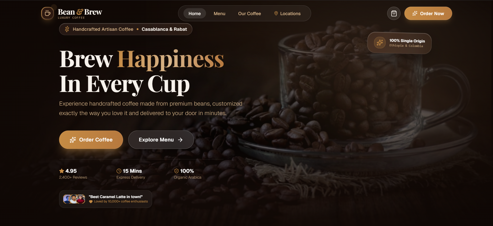

# ☕ Bean & Brew

### Handcrafted Luxury Coffee

A modern and responsive coffee shop web application designed to provide a smooth, elegant, and engaging online ordering experience.



---

## 📖 About the Project

**Bean & Brew** is a modern coffee shop website developed as a practical project during the **Web Design avec l'AI** training at **Orange Digital Center Rabat**.

The project focuses on creating a visually appealing and interactive user experience while applying modern front-end development and UI/UX design principles.

The website allows users to explore the coffee menu, view product details, customize their orders, manage their shopping cart, and complete the checkout process.

---

## ✨ Features

### 🏠 Modern Landing Page

* Elegant coffee-inspired visual identity
* Responsive hero section
* Clear calls to action
* Smooth animations and transitions

### ☕ Coffee Menu

Users can explore a variety of products and view:

* Product name
* Price
* Description
* Ingredients
* Rating
* Number of reviews
* Product image

### 🛒 Shopping Cart

The application provides an interactive shopping cart where users can:

* Add products
* Remove products
* Increase or decrease quantities
* Customize products
* Clear the cart
* Review the order before checkout

### 💳 Checkout

A complete front-end ordering flow:

```text
Menu → Product → Cart → Checkout → Order Confirmation
```

### 🌙 Light & Dark Mode

Users can switch between Light and Dark themes.

The selected theme is stored locally so that the preference remains after refreshing the page.

### 📱 Responsive Design

The interface is designed to provide a consistent experience across:

* 📱 Mobile
* 📲 Tablet
* 💻 Desktop

---

## 🛠️ Technologies

The project was built using modern front-end technologies:

* **React**
* **TypeScript**
* **Vite**
* **Tailwind CSS**
* **Lucide React**
* **Motion**
* **LocalStorage**
* **Git & GitHub**

---

## 📂 Project Structure

```text
bean-and-brew/
│
├── public/
│   └── screenshot.png
│
├── src/
│   ├── assets/
│   ├── components/
│   └── ...
│
├── index.html
├── package.json
├── package-lock.json
├── tsconfig.json
├── vite.config.ts
├── .gitignore
└── README.md
```

> The exact structure may evolve as the project develops.

---

## 🚀 Getting Started

### Prerequisites

Make sure you have the following installed:

* [Node.js](https://nodejs.org/)
* npm

### 1. Clone the repository

```bash
git clone https://github.com/abdellatif-kharbat/bean-and-brew.git
```

### 2. Navigate to the project

```bash
cd bean-and-brew
```

### 3. Install dependencies

```bash
npm install
```

### 4. Start the development server

```bash
npm run dev
```

The application will be available at the local URL provided by Vite.

---

## 🏗️ Build for Production

Create a production build:

```bash
npm run build
```

Preview the production build locally:

```bash
npm run preview
```

---

## 🎨 Design

The visual identity of **Bean & Brew** is inspired by the atmosphere of a luxury artisanal coffee shop.

The design focuses on:

* ☕ Coffee-inspired aesthetics
* ✨ Elegant visual details
* 📐 Clean layouts
* 🎞️ Smooth interactions
* 📱 Responsive design
* 🧭 Simple navigation
* 🛒 User-friendly ordering experience

The goal is to combine **visual quality with usability**.

---

## 🤖 AI & Web Design

This project was developed as part of the **Web Design avec l'AI** training at **Orange Digital Center Rabat**.

Artificial Intelligence was explored as a tool to support the web design and development workflow, including:

* Generating design ideas
* Exploring UI concepts
* Improving layouts
* Assisting with front-end development
* Exploring user experience improvements
* Refining and iterating on interface components

The generated ideas and code were reviewed, adapted, and integrated as part of the development process.

---

## 🎓 Training

### Web Design avec l'AI

**Orange Digital Center — Rabat, Morocco**

This project represents a practical application of the concepts explored during the training, including:

* UI/UX Design
* Responsive Web Design
* Front-End Development
* AI-assisted development
* Modern web technologies

---

## 👨‍💻 Author

### Abdellatif Kharbat

**Computer Engineering Student & Developer**

🇲🇦 Morocco

This project was designed and developed by **Abdellatif Kharbat** during the **Web Design avec l'AI** training at **Orange Digital Center Rabat**.

---

## 📚 What I Learned

Through this project, I practiced and improved my skills in:

* React
* TypeScript
* Tailwind CSS
* Responsive Web Design
* UI/UX Design
* Component-based development
* State management
* LocalStorage
* Interactive interfaces
* Git & GitHub
* AI-assisted web development

---

## 🔮 Future Improvements

Possible future improvements include:

* 🔐 User authentication
* 🗄️ Backend and database integration
* 📦 Real order management
* 💳 Online payment integration
* 👨‍💼 Admin dashboard
* 📍 Order tracking
* 📧 Order confirmation by email

---

## 📄 License

This project was developed for **educational purposes** as part of the **Web Design avec l'AI** training.

---

## 🙏 Acknowledgements

Special thanks to **Orange Digital Center Rabat** and the trainers for providing the opportunity to learn, experiment, and build this project during the **Web Design avec l'AI** training.

---

### ☕ Bean & Brew

**Handcrafted Luxury Coffee — Crafted with code and creativity.**
